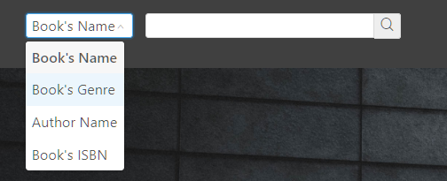

# Home Page
## Description
HomePage is website enter.

## Login Require
No, any user can enter this page.

## Layout
### Upper Area
Upper area is navigation, includes website title, search area and "Login" button or user menu.

### Right Area
Right area is recommend book area, Upper is "Recommend" title, lower is card flow.

Card flow's background is black and have Gaussian blur.

Every card's left area is book's cover picture, right is book's name and description. If the book's name and description is too long, it will be crop and show in a popover area.

### Other Area
Central area will show the homepage background image.

## Function
* Function 1: Jump to Home Page

In any page, user can click "XDU Libiary" title to jump to home page.

* Function 2: Search Book

In any page, user can search book by Search Area.

Step1: Click the search type selector to select search way(By Book's Name, Author, ISBN or Genre).

Step2: Input search value. When the search way is Genre, the input area will become to selector area.

Step3: Press "Enter" key or click search icon jump to SearchResult page.

* Function 3: Show Login Page

In any page, if user is not login, click the Login button will show the Login Page.

* Function 4: Show User Menu.

In any page, if user is login, the upper right corner will show the user avatar and user name,
click user name will show user menu.

* Function 5: User Menu.

In any page, if user is login and user is reader, click user name will show reader's user menu, includes UserInfo link, Order Page link and log out button.

If user is login and user is librarian, click user name will show librarian's user menu, includes order management link, create reader link, edit reader link, add book link and log out button.

* Function 6: View Recommend and Junp to Book Detail Page

User can view recommend books, click card can jump to Book Detail Page(Librarian will jump to Edit Book Page).

## Note
1. In any page, if user click log out button, system will jump to Home Page.
2. The Book Genre is:
    1. Arts
    2. Business
    3. Computer Science
    4. Data Science
    5. Engineering
    6. Language Skills
    7. Life Science
    8. Mathematics
    9. Personal Development
    10. Physics
    11. Social Science

# Login Page
## Description
User can login system in Login Page .

## Login Require
No, only visitor can enter this page.

## Layout
### Upper Area
Upper area is Login Page title.

### Central Area
Central area includes StudentID or Telphone Number input area and password input area.

### Bottom Area
Botton area is Login button.

## Function
* Function 1: Login

Step1: Select login way from StudentID or Telphone Number.

Step2: Input StudentID or Telphone.

Step3: Input password.

Step4: Click "Log In" button.

If login failed, System will show warning notification from upper right corner.

if login success, system will jump to previous page.

## Note
1. StudentID is a number, it's length is 11.
2. Telphone Number is a number, it's lenght is 11 and first number is 1, just like 1xxxxxxxxxx.
3. Password's length is more than 6 and less then 16, and case sensitive.
4. If format of StudentID, Telphone number or password is wrong, system will show red tips under input area.

# Reader Info Page
## Description
Reader's personal information page. Reader can click user name and click UserInfo link jump to this page.

## Login Require
Yes, Only reader can enter this page. 

## Layout
### Upper Area
Upper Area is user's base info, includes user name, studentID, telphone and balance.

### Left Area
Left area is user's avatar, file selector button and upload button.

### Right Area
Right area is user's browse history, Upper is "Browse History" title, lower is card flow.

Card flow's background is black and have Gaussian blur.

Every card's left is book's cover picture, right is book's name and description. If the book's name and description is too long, it will be crop and show in a popover area.

### Bottom Area
Bottom Area will show the number of overdue order and overdue order's info(includes book's name, ISBN, position, amount, overdue time and fine).

## Function
* Function 1: Change user's avatar

Step1: Click the file selector button.

Step2: select new avatar and click "Open" button.

Step3: Click upload button.

If upload success, the user's avatar will become new avatar and show success notification.

* Function 2: Jump to Order List

Click the number of overdue order will jump to Reader Order List page.

* Function 6: View history and Junp to Book Detail Page

Reader can view history book, click card can jump to Book Detail Page.

## Note
1. User's avatar only support .jpg, .png and .gif file.
2. Overdue order's fine is not auto update, need reader manual refresh.
